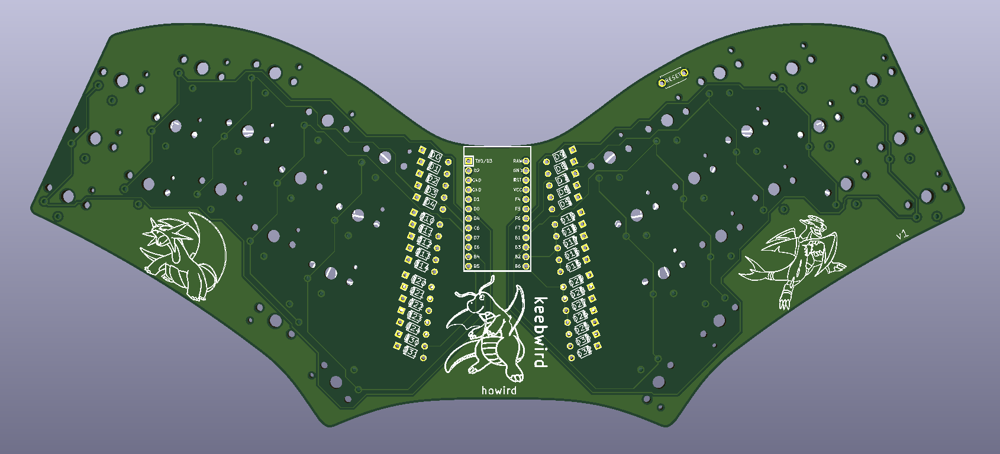

# keebwird

low-profile, column-staggered, unibody, 34 key mechanical keyboard based on the ferris sweep

custom symbols and footprints from [MX_Alps_Hybrid](https://github.com/ai03-2725/MX_Alps_Hybrid) and [Keebio](https://github.com/keebio)

QMK firmware can be found [here](https://github.com/howird/keebwird_firmware)
 
 # BOM
| Name                             | Quantity          |
|----------------------------------|-------------------|
| Arduino Pro Micro                | 1 |
| General-purpose diode (DO-35)    | 34 |
| Kailh Choc Switches              | 34 |
| Choc Keycaps                     | 34 |
| Reset Swich  (Optional)          | 1 |

