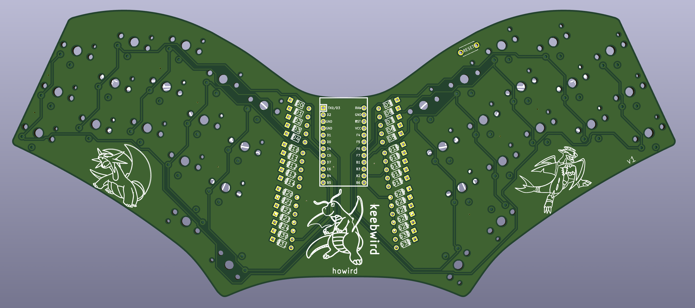

# keebwird

low-profile, column-staggered, unibody, 34 key mechanical keyboard based on the ferris sweep

 custom symbols and footprints from [MX_Alps_Hybrid](https://github.com/ai03-2725/MX_Alps_Hybrid) and [Keebio](https://github.com/keebio)
